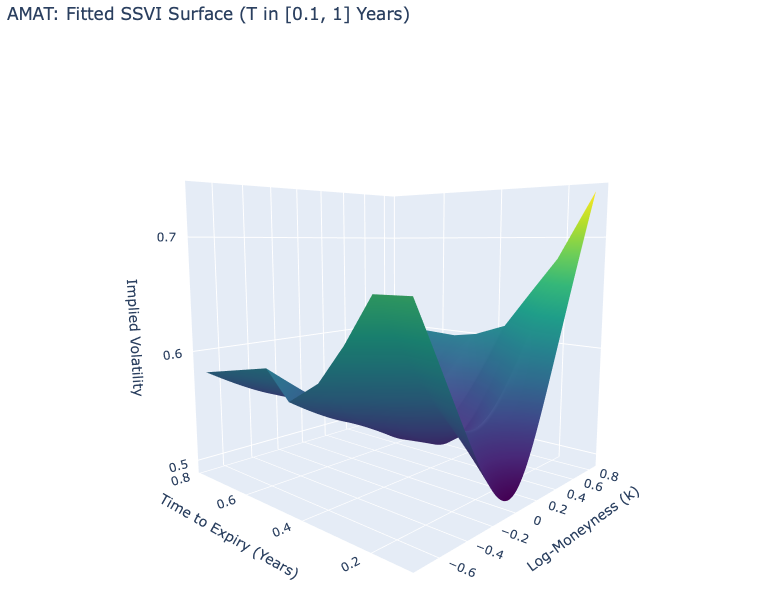
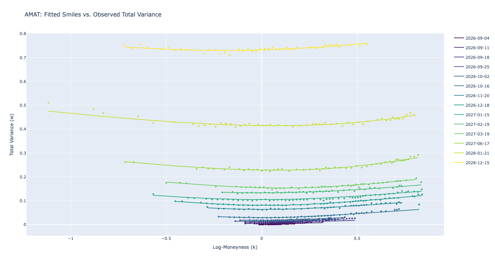
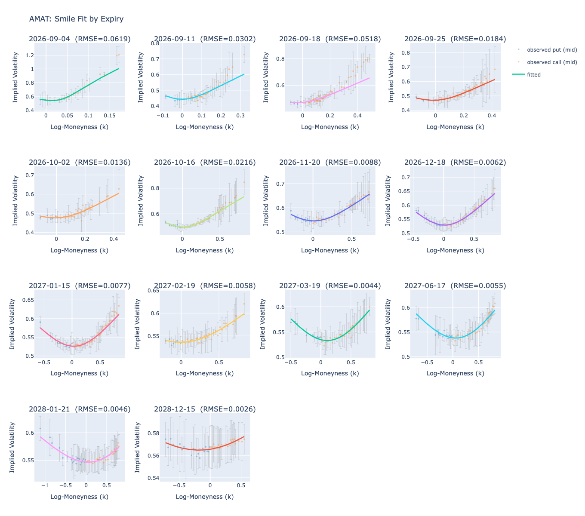
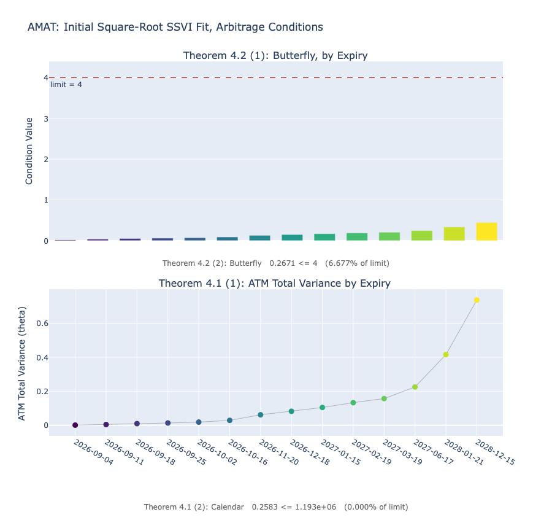
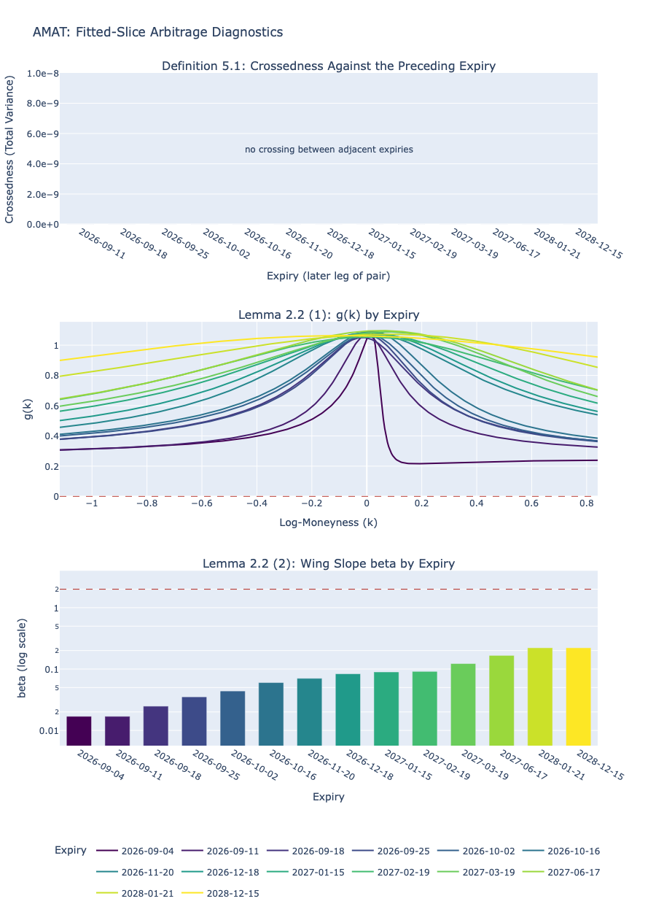
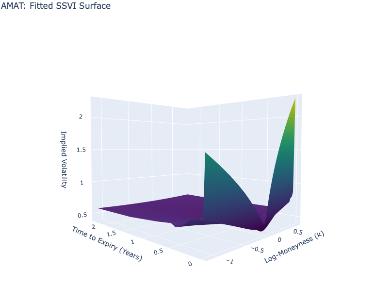

# SSVI live
[](https://arxiv.org/abs/1204.0646)
[](https://www.python.org/)
[](LICENSE)
<p align="center">
  
</p>

## Introduction
This project fits an SSVI implied volatility surface to live chains via `yfinance`, verified free of calendar-spread arbitrage and butterfly arbitrage, by implementing Gatheral and Jacquier's [Arbitrage-free SVI volatility surfaces (2013)](https://arxiv.org/abs/1204.0646). 

Demo shows 14 expiries fitted:
- Median slice RMSE ~.008 in IV; beyond the front month, all slices have RMSE under .03 in IV.
- No calendar-spread arbitrage on the surface: ATM total variance is monotonically increasing in time across every slice. Gatheral's "crossedness" measure is 0 across all real k.
- No butterfly arbitrage in the verified range: both conditions of Gatheral's Lemma 2.2 hold for every expiry-slice: g(k) > 0 across all traded k; lim d+(k) = -∞ everywhere.

The project implements Section 5.2 of the paper; the absence of static arbitrage is optimized for and verified, not enforced. See [Design Decisions and Limitations](#design-decisions-and-limitations) for exact claims. 

## Quickstarts
```bash
pip install -e .
python -m ssvi_live.main   # offline demo fits AMAT from included data and opens the Plotly diagnostics
```

```python
from ssvi_live import live_fit, demo, FitConfig
demo(FitConfig(sbf = .05))      #plot offline data with custom config
surface = live_fit("AMAT", config=FitConfig(sbf=0.05))      # live chain via yfinance with custom config
```

## How it works
Given a ticker, the pipeline:
1. __Fetches and cleans__ a live option chain for a listed equity with `yfinance`, merges calls and puts, and drops stale/crossed quotes (`data.py`).
2. __Backs out forward prices__ per expiry by put-call parity, then inverts the bid and ask to Black-76 implied vol and reprices the mid-IV rather than taking mids directly (explained in [Design Decisions and Limitations](#design-decisions-and-limitations)).
3. __Fits a global "initial guess"__ from the square-root SSVI. A global pair of parameters (__rho__, __eta__) is fit across every expiry in price space, with ATM total variance (theta) read off the chain (`fit_ssvi._first_fit`). This starting surface is guaranteed to be free of calendar spread arbitrage everywhere and butterfly arbitrage up to some time __t\*__ (Theorems 4.1 and 4.2), but generally poorly fits market prices.
4. __Refits each expiry independently__ in the natural parameterization with a "heavy penalty" for any crossings with its neighboring slices (`crossedness`). This is the pivotal step that allows parameters to drift, losing the mathematical safety but gaining better fits (`fit_ssvi._refit`, `_fit_all`). 
5. __Diagnoses the result__ by checking to ensure parameter drift did not allow re-entry of arbitrage (Definition 2.2 and Lemma 2.2). SVI slices are plotted with RMSE, a calendar-arbitrage / butterfly-arbitrage panel, and the fitted surface in 3D (`fit_ssvi.surface_diagnostics`, `plotting.py`).

<p align="center">
  
  <em>No crossings between expiries in total variance-space visually demonstrates the surface is calendar arbitrage-free.</em>
  <br><br>
  
  <em>Per-slice fit quality.</em>
</p>

<p align="center">
  
  
  <br><em>Initial SSVI static arbitrage diagnostics (left) and verification on the fitted slices (right).<br>Calendar-arb violations are 0 in total variance, see Limitation 1.4. Butterfly-arb condition g(k) is above 0 across all traded k.</em>
</p>

## Design Decisions and Limitations
1. __Faithful reproduction__: The purpose of this project is to faithfully reproduce Gatheral's method, not necessarily to produce the best-possible fit. Several limitations come from this: 
    1. Fits are poorer at very near expiries, this is an expected consequence of the parameterization and fitting in volatility-space (at low TTE, IV is very small, so the residual surface is essentially flat).
    2. Fitting is done in a single forward sweep. Slices which do not converge in one pass are discarded (See 5.2 or the `_fit_all` docstring).
    3. Gatheral's procedure relies on fitting the square-root SSVI as an initial guess, which by construction is free of calendar arbitrage everywhere and butterfly arbitrage up to some expiry __t\*__. However, he then allows parameters of each slice to be fitted to market data. The high penalty for crossings should prevent arbitrage from re-entering, but as soon as the fit starts, the surface is no longer mathematically guaranteed to be arbitrage-free and has to be tested.
    4. The calendar arbitrage penalty (`crossedness`) is zero if the slices are arbitrageable everywhere (previous slice > current slice for all k). In practice this error can never occur: the initial fit is in the SSVI family (see Theorem 4.1), so reaching calendar arbitrage from the initial fit requires a crossing. 
    5. To prevent re-entry of calendar arbitrage, Gatheral penalizes crossings across all real k which is mathematically ideal but practically unreasonable in some cases -- calendar arbitrage is quickly pushed far up into the wings and beyond the traded range, exactly where the optimizer lacks residuals. Enforcing this means some slices will not converge. The script can handle either mode, see the `FitConfig` docstring for details.

2. __Calculating mid prices in IV__: Gatheral starts his procedure given a vol surface and calculates prices. Starting from market data seems to obviate this step, but it dramatically improved fits in testing. I believe this is because market quotes in price-space implicitly include a vega term, so taking the mid on wide spreads systematically over-vols the wings. Explicit vega-weighting is *not* included in Gatheral's fitting procedure.

3. __The forward price and discount rate__: Even though the targets of this script are single-name Americans, a two-pass put-call parity procedure is used to calculate the forward and the discount rate (inspired by the CBOE VIX). This is justified because the data comes from OTM puts and barely ITM calls, where the Americans are near-European. It is necessary because like Gatheral's parameterizations and no-arbitrage guarantees are in terms of the forward F, not spot. The same procedure generates a rate for each expiry, but the fit uses a flat constant rather than the term structure. While it may seem like throwing away free data, on single-name Americans whose maximum years-to-expiry are ~2, a term structure is not appreciable, and worse, badly behaved at short expiries. A time-square weighted average (minimizing the influence of near expiries) producing a single flat rate was universally better fitting. Rates and de-americanization are not the point of this project, so these compromises limited the scope.


<p align="center">
  
  <br><em>The untrimmed surface shows the near-expiry blowup discussed in limitation 1.1.</em>
</p>

## References
Jim Gatheral and Antoine Jacquier, "Arbitrage-free SVI volatility surfaces," 2013. [arXiv:1204.0646](https://arxiv.org/abs/1204.0646).

Agent-written code is disclosed in-source: the quartic root finder `fit_ssvi._find_svi_roots` and the `plotting` module. All other code is mine.

## License
MIT — see [LICENSE](LICENSE).
